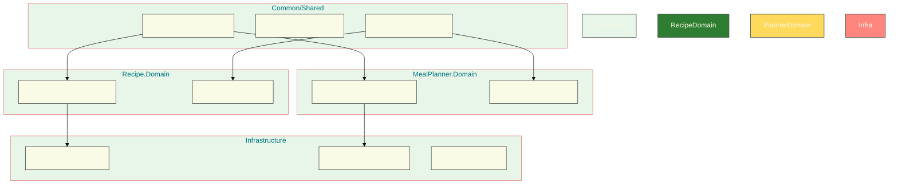

```mermaid
%%{ init: {
  'theme': 'dark',
  'themeVariables': {
    'darkMode': true,
    'background': '#1A1B1E',
    'primaryColor': '#2E7D32',
    'primaryTextColor': '#E8F5E9',
    'secondaryColor': '#FFD95C',
    'tertiaryColor': '#FF867F',
    'mainBkg': '#1A1B1E',
    'nodeBkg': '#2D2E31',
    'nodeTextColor': '#E8F5E9',
    'lineColor': '#4CAF50',
    'clusterBkg': '#2D2E31'
  }
} }%%

graph TB
    subgraph "Frontend (Flutter)"
        style Frontend fill:#2D2E31,stroke:#2E7D32
        MobileApp[Mobile App]
        RecipeUI[Recipe Views]
        PlannerUI[Meal Planner]
        SearchUI[Search Interface]
    end

    subgraph "Recipe Write API"
        style RecipeWrite fill:#2D2E31,stroke:#2E7D32
        CommandAPI[Recipe Command API]
        RecipeService[Recipe Service]
        EventPublisher[Event Publisher]
        RecipeDB[(Recipe PostgreSQL + pgvector)]
    end

    subgraph "MealPlanner Read API"
        style MealPlanner fill:#2D2E31,stroke:#FFD95C
        QueryAPI[MealPlanner Query API]
        MealPlannerService[Meal Planning Service]
        MaterializedView[(Materialized View)]
        SearchService[Vector Search Service]
    end

    subgraph "Message Bus"
        style MessageBus fill:#2D2E31,stroke:#FF867F
        RabbitMQ{RabbitMQ}
        RecipeEvents[Recipe Events]
    end

    %% Frontend connections
    MobileApp --> RecipeUI
    MobileApp --> PlannerUI
    MobileApp --> SearchUI

    %% API connections
    RecipeUI --> CommandAPI
    PlannerUI --> QueryAPI
    SearchUI --> QueryAPI

    %% Write flow
    CommandAPI --> RecipeService
    RecipeService --> RecipeDB
    RecipeService --> EventPublisher
    EventPublisher --> RabbitMQ

    %% Message flow
    RabbitMQ --> RecipeEvents
    RecipeEvents --> MaterializedView

    %% Read flow
    QueryAPI --> MealPlannerService
    MealPlannerService --> MaterializedView
    MealPlannerService --> SearchService
    SearchService --> MaterializedView

```

# PlatePilot 🍳

PlatePilot is an intelligent recipe management and meal planning application that helps you discover, organize, and plan your meals. Using AI-powered recommendations, it suggests personalized meal combinations based on your preferences, dietary restrictions, and previous meal selections.

## Features ✨

- Recipe management with detailed ingredients and instructions
- AI-powered meal planning and suggestions
- Smart search functionality across recipes
- Cross-platform mobile application (iOS & Android)
- Vector-based recipe similarity search
  Support for dietary restrictions and preferences

## Architecture 🏗️

